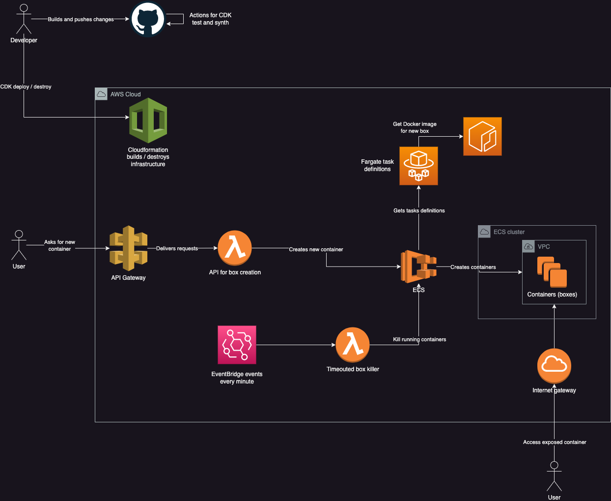

# Efimeral API infrastructure configuration

## API documentation

* [Plain HTML](https://ariel17.com.ar/efimeral-api/swagger/index.html)
* [Swagger console](https://app.swaggerhub.com/apis-docs/ariel17/efimeral/0.2.0)

[AWS CDK](https://aws.amazon.com/cdk/) is used to configure cloud architecture.
The intention is leaving none idle resources consuming money, so Fargate tasks
are used for container instances and Lambdas as API handlers. Currently it
takes almost 40 seconds for a container to be up and running, so I am evaluating
to use a warm strategy on future versions.

## Required secrets for GitHub Actions

* AWS_ACCESS_KEY_ID
* AWS_SECRET_ACCESS_KEY
* AWS_REGION

## Resources

* [Working with the AWS CDK in TypeScript](https://docs.aws.amazon.com/cdk/v2/guide/work-with-cdk-typescript.html)
* [Migrating from SDK v2 to v3](https://docs.aws.amazon.com/sdk-for-javascript/v3/developer-guide/migrating-to-v3.html)
* [AWS SDK for Javascript v3](https://docs.aws.amazon.com/AWSJavaScriptSDK/v3/latest/)

## Related projects

* [Efimeral web](https://github.com/ariel17/efimeral-web)
* [Efimeral images](https://github.com/ariel17/efimeral-images)
